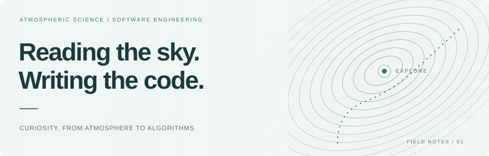
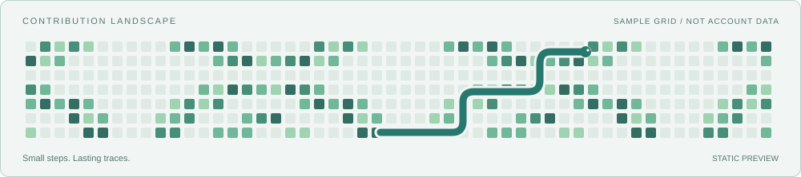

<picture>
  <source media="(prefers-color-scheme: dark)" srcset="assets/banner-dark.svg">
  
</picture>

# 奶茶鼠

**Atmospheric Scientist & Developer**

我是一只奶茶鼠，也是一位气象学家。关注数值天气预报、气候模拟与高性能计算，也开发服务科研与日常生活的应用。

---

## Atmospheric Science

数值天气预报 · 气候数值模拟 · 科学计算

## Computing

通用分析、高性能算法与数值模式开发。

## Agent Stack

让工具参与探索，把判断留给自己。

## Developer Tools

在 Linux / WSL 中开发，用版本控制保留思考轨迹。

## GitHub Stats

演示占位，尚未连接 GitHub 账号。

<picture>
  <source media="(prefers-color-scheme: dark)" srcset="assets/stats-dark.svg">
  
</picture>

## Contribution Snake

示例网格与静态贪吃蛇，仅用于查看风格，不代表真实贡献记录。

<picture>
  <source media="(prefers-color-scheme: dark)" srcset="assets/snake-dark.svg">
  
</picture>

---

主页风格 Demo · 文案与工具清单待最终确认
